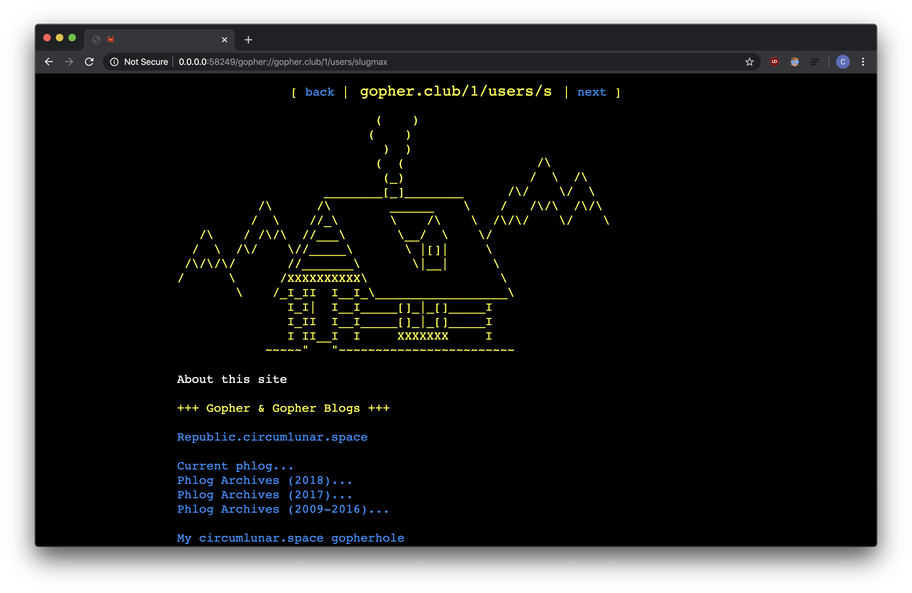
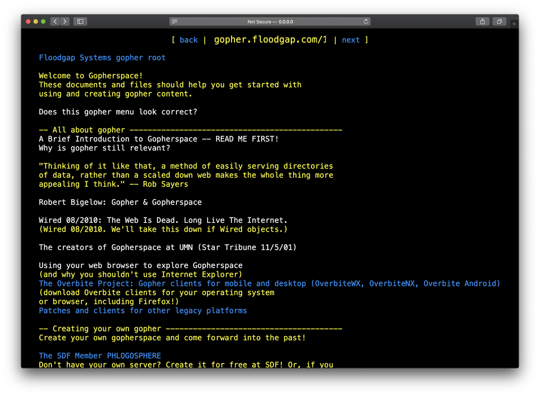
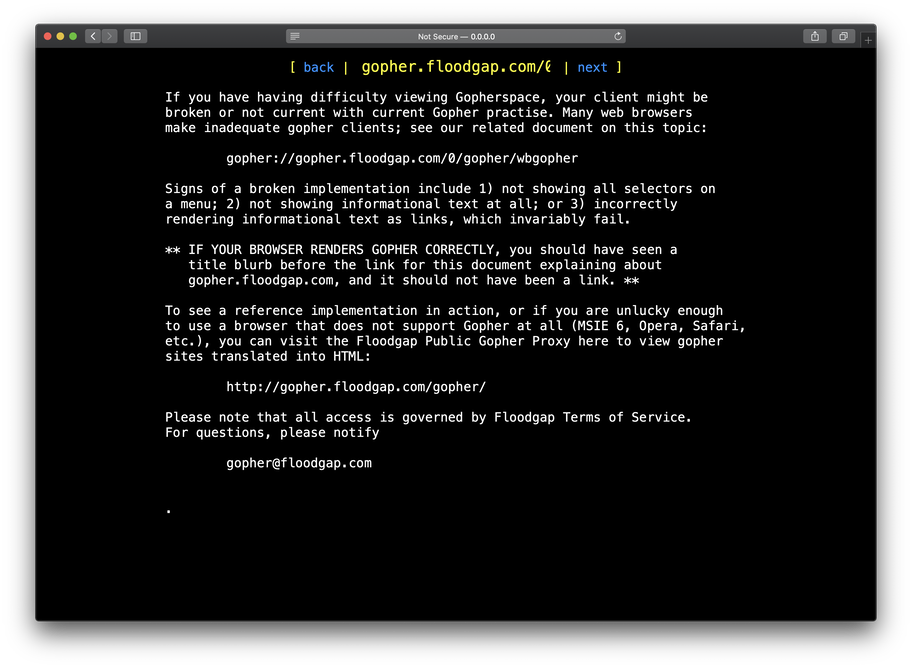
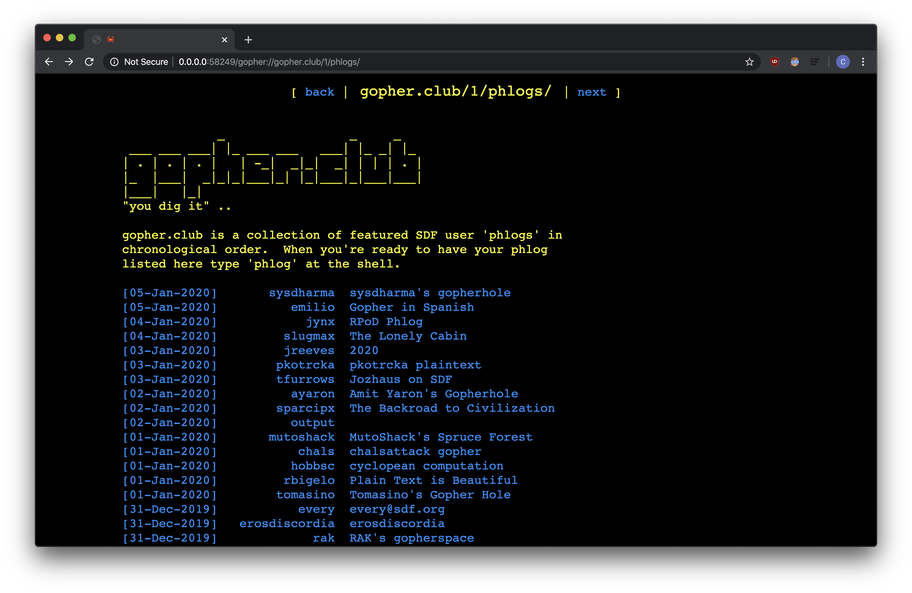

<!--
      /            \    /      
 ___ (___  ___  ___ \  /       
|   )|   )|   )|   ) \/  \   )
|__/ |  / |    |__/  /\   \_/ 
|                   /  \   /  
                   /    \
--> 

`phroxy` is a small, multi-threaded web server that proxies Gopher
requests through HTTP. It's meant to be run locally and was written
for [gogo](https://github.com/dvkt/gogo), a WebKit Gopher client.

## usage

    Usage:
    
        phroxy [options]

    Options:

        -p, --port NUM    Port to bind to.
        -h, --host NAME   Hostname to bind to.
    
    Other flags:  
    
        -h, --help        Print this screen.
        -v, --version     Print phd version.

## installation

binaries for linux, mac, and raspberry pi will be available soon
at https://github.com/dvkt/phroxy/releases

## development

    cargo run -- -p 8080

## screenies

|||
|:-:|:-:|
| The Lonely Cabin | gopherproject.org |

|||
|:-:|:-:|
| gopherproject.org | sdf.org |
